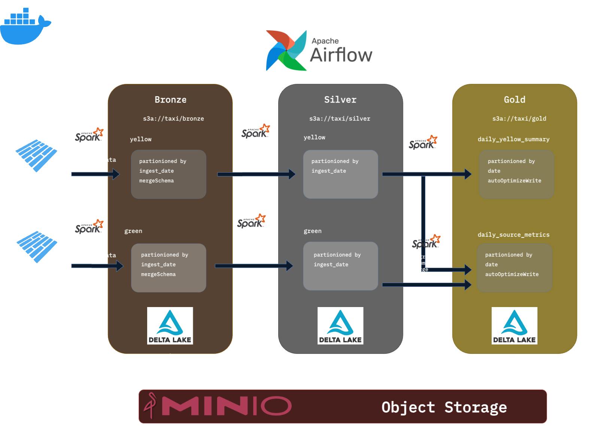
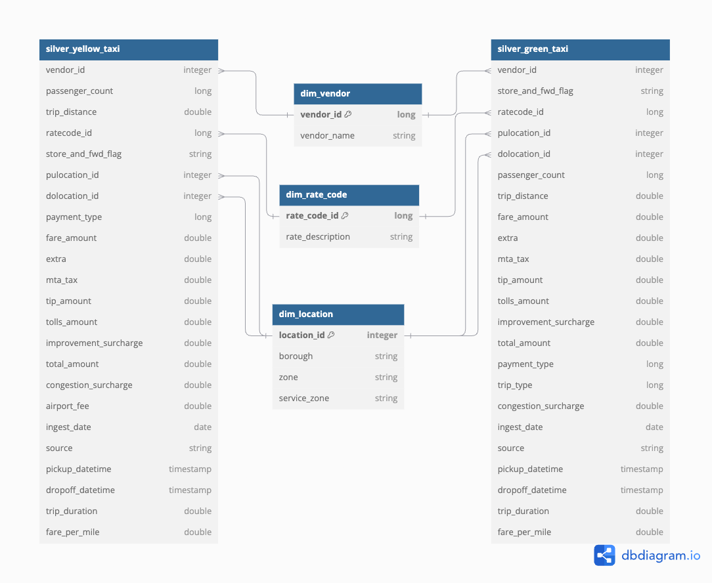

# NYC Taxi Lakehouse
&nbsp;&nbsp;&nbsp;&nbsp;This project focuses on analyzing NYC Taxi trip data building **DataLakehouse**, leveraging **Apache Spark** for data processing, **Delta Lake** as the table format for efficient storage in **MinIO**, and **Apache Airflow** for pipeline orchestration. The pipeline extracts raw data from NYC's Yellow and Green taxi datasets, performs cleaning and transformation, and uses the **Medallion Architecture** to organize data into **Bronze**, **Silver**, and **Gold** layers.
The project provides key insights into taxi trips, such as daily average fares, trip distances, and service comparisons.
## Data Source
- [Yellow and Green Taxi Data](https://www.nyc.gov/site/tlc/about/tlc-trip-record-data.page):  NYC taxi trip records from the TLC.

## Medallion Architecture
The Medallion Architecture is a data design pattern that organizes data into progressive layers of refinement. It aims to incrementally improve the structure and quality of data as it flows through the architecture. 
> You can read the detailed experiment and implementation in [notebook_read.ipynb](notebook_read.ipynb).

### Bronze Layer
- Stores raw, unprocessed taxi trip data in Delta table format, with added metadata columns.
- Acts as the foundational layer, retaining data exactly as ingested from the source.
### Silver Layer
- Contains validated, deduplicated, cleaned, standardized, and enriched data.
#### Table Schema


### Gold Layer
- Contains aggregated and analytical data views for business intelligence and reporting.
- Table 
   1.  **gold_yellow_taxi_daily_summary** daily summary of Yellow Taxi trips
    **Columns**: `date`, `total_trips`, `total_fare_amount`, `average_trip_distance`, `average_trip_duration`
   2. **gold_daily_source_metrics** daily comparison of Yellow and Green Taxi
**Columns**: 
      - `date`,  
      - `green_avg_fare`, `green_min_fare`, `green_max_fare`,
      - `green_avg_trip_distance`, `green_min_trip_distance`, `green_max_trip_distance`, `green_total_trips`, 
      - `yellow_avg_fare`, `yellow_min_fare`, `yellow_max_fare`,  
      - `yellow_avg_trip_distance`, `yellow_min_trip_distance`, `yellow_max_trip_distance`, `yellow_total_trips`  


## Requirements
- [Astro CLI](https://www.astronomer.io/docs/astro/cli/install-cli/) (This project structure was init by `astro dev init`)
- Docker Desktop (v18.09 or higher) or Podman

## Project Structure
This project contains the following files and directories:
- **dags**: Contains Python files for your Airflow DAGs.
- **Dockerfile**: Specifies a versioned Astro Runtime Docker image, providing a customized Airflow experience. Use this file for runtime overrides or additional commands.
- **include**: For any additional files you want to include as part of your project. Empty by default.
- **packages.txt**: List OS-level packages needed for your project here. These will be installed during container build.
- **requirements.txt**: Specify Python packages needed for your project.
- **airflow_settings.yaml**: Define Airflow Connections, Variables, and Pools locally instead of configuring them via the Airflow UI.
- **docker-compose.override.yml**: Extends the default Docker Compose setup with custom services or configurations.
- **mount directories**: Mount directories to docker container for mock data and additional services:
  - `spark`: Dockerfile for spark and Sharding directory (Emulate directory for download file) for spark cluster
  - `data-mock`: Mock data like datasource.
  - `bucket-data`: Simulates an object storage bucket (e.g., MinIO).

---

## Start Project Locally
Create .env file in the root directory.
```
MINIO_ACCESS_KEY="minio"
MINIO_SECRET_KEY="minio123"
MINIO_URL="http://minio-bucket:9001"
```

Then run the following command

```
astro dev start
```
Find Airflow network astro default network by following command then set Airflow network in docker-compose.override.yml to make other component access by Airflow
```
docker network ls
```

Airflow services:
- Postgres: Airflow’s metadata database.
- Webserver: Renders the Airflow UI.
- Scheduler: Monitors and triggers tasks.
- Triggerer: Handles deferred tasks.

### Access the Airflow UI
Navigate to http://localhost8080
- Username: `admin`
- Password: `admin`

### Additional Components
#### Minio
A MinIO container is included in this project to simulate object storage for DeltaLake.
- Access WebUI at http://localhost:9000
- Credential depend on .env file
   - **Access Key**: `minio`
   - **Secret Key**: `minio123`

#### Standalone Spark Cluster
A Standalone Spark cluster for distributed data processing:
- **Spark Master**: Accessible via `spark://spark-master:7077`
- **2 Spark Workers**: Connected to the Spark master by default

## NOTES
- Modify `docker-compose.override.yml` to customize container configurations.
- Place mock datasets in the `data-mock` directory to simulate data sources.


